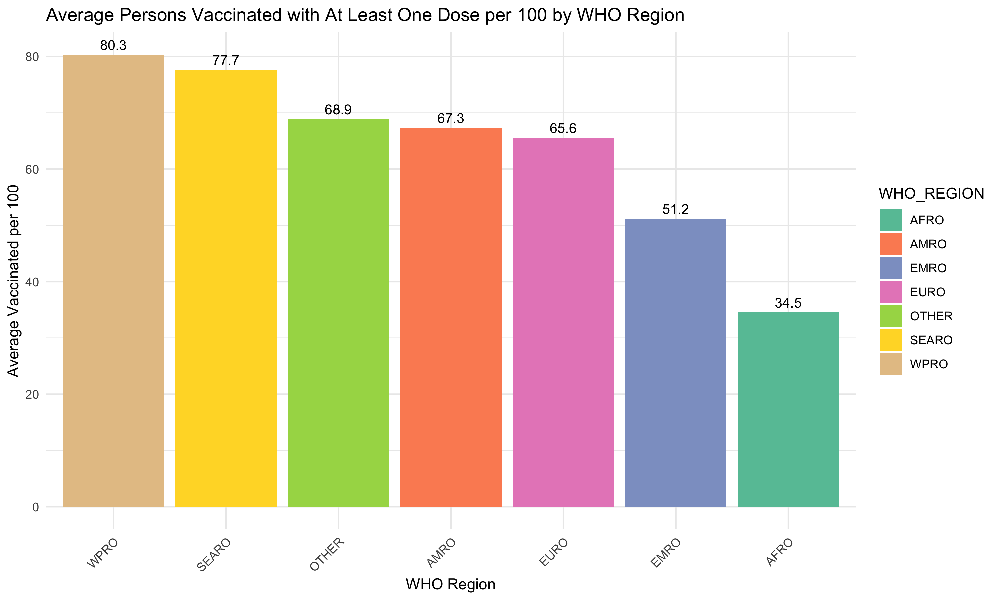

# COVID-19 Data Analysis Assignment

This repository contains solutions to 10 questions related to COVID-19 cases and vaccination data. Each answer includes a notebook or R script and associated figures.

## Questions and Solutions

1. **Which 10 countries have the highest cumulative COVID-19 cases per 100,000 population?**

   - [Solution Notebook](answers/01/solution.ipynb)
   - 

2. **Which WHO regions have the highest total cumulative cases?**

   - [Solution Notebook](answers/02/solution.ipynb)
   - 

3. **Is there a correlation between cumulative cases and cumulative deaths across countries?**

   - [Solution Notebook](answers/03/solution.ipynb)
   - 

4. **Which 10 countries have the highest deaths per 100,000 population?**

   - [Solution Notebook](answers/04/solution.ipynb)
   - 

5. **What is the distribution of total vaccinations per 100 across countries?**

   - [Solution Notebook](answers/05/solution.ipynb)
   - 

6. **Which vaccines are the most commonly used across countries?**

   - [Solution Notebook](answers/06/solution.ipynb)
   - 

7. **Is there a correlation between persons fully vaccinated per 100 and deaths per 100,000 population?**

   - [Solution Notebook](answers/07/solution.ipynb)
   - 

8. **Which 10 countries have the highest booster doses per 100?**

   - [Solution Notebook](answers/08/solution.ipynb)
   - 

9. **What is the average persons vaccinated with at least one dose per 100 by WHO region?**

   - [Solution R Script](answers/09/solution.R)
   - 

10. **What is the distribution of the number of vaccine types used by countries?**
    - [Solution R Script](answers/10/solution.R)
    - 
